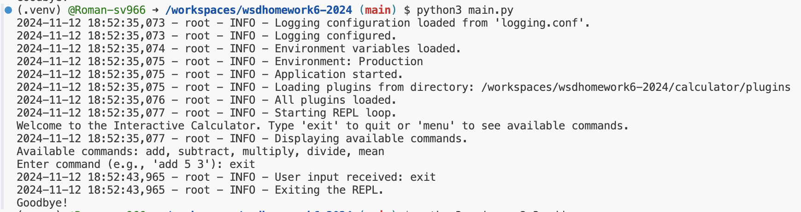

# Homework-6 : 2024

# Multiprocessing-Enabled Interactive Calculator With Devops, Cloud Computing, Environment Variables, Logging, and Continuous Integration

This project is an interactive, command-line calculator that supports essential arithmetic operations with optional multiprocessing for enhanced efficiency. The calculator can operate in both interactive and direct command-line modes, and it’s designed to be flexible and easily extendable.

# Logs sample

## Key Features

- **Core Arithmetic Functions**: Provides operations for addition, subtraction, multiplication, and division.
- **Multiprocessing Capability**: Allows calculations to be executed in parallel using separate processes, which can improve performance, especially for multiple or intensive calculations.
- **Interactive REPL Interface**: Users can interactively enter commands in a Read-Eval-Print Loop (REPL), making the calculator easy to use.
- **Robust Error Management**: Displays clear error messages for issues such as invalid inputs, division by zero, and unrecognized operations.
- **Plugin Architecture**: Dynamically loads command plugins, allowing easy extension of functionality by adding new operations.
- **Command-Line Mode**: Users can specify operations directly via command-line arguments.
